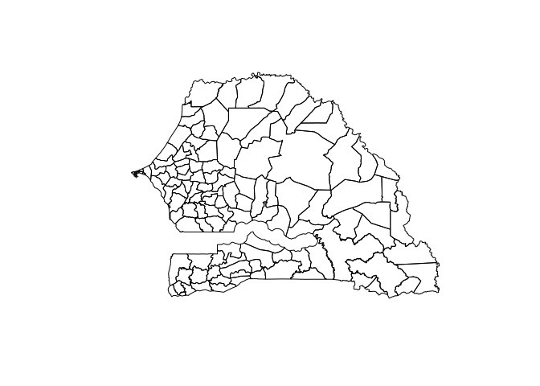

<!-- README.md is generated from README.Rmd. Please edit that file -->

# rgeoboundaries

<!-- badges: start -->

<!-- badges: end -->

The goal of rgeoboundaries is to …

## Installation

You can install the released version of rgeoboundaries from
[CRAN](https://CRAN.R-project.org) with:

``` r
remotes::install_gitlab("dickoa/rgeoboundaries")
```

## Example

This is a basic example which shows you how to solve a common problem:

``` r
library(rgeoboundaries)
sen_adm3 <- geoboundaries("sen", "adm3")
plot(st_geometry(sen_adm3))
```


