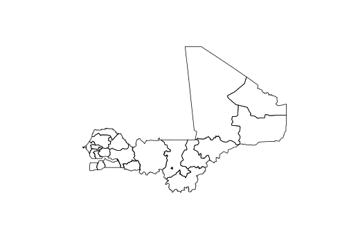

<!-- README.md is generated from README.Rmd. Please edit that file -->

# rgeoboundaries

<!-- badges: start -->

[](http://www.repostatus.org/#wip)
[](https://gitlab.com/dickoa/rgeoboundaries/pipelines)
[](https://cran.r-project.org/package=rgeoboundaries)
[](https://opensource.org/licenses/MIT)

`rgeoboundaries` is an R client for the [GeoBoundaries
API](https://www.geoboundaries.org/)

<!-- badges: end -->

## Installation

You can install the development version of rgeoboundaries using the
`remotes` package:

``` r
# install.packages("remotes")
remotes::install_gitlab("dickoa/rgeoboundaries")
```

## Access administrative boundaries using rgeoboundaries

This is a basic example which shows you how get Senegal administrative
level 3 boundaries and plot it

``` r
library(rgeoboundaries)
library(sf)
mli_sen <- gb_adm1(c("mali", "senegal"))
plot(st_geometry(mli_sen))
```



``` r
knitr::kable(gb_metadata(c("mali", "senegal"), "adm1"))
```

| boundaryID            | boundaryISO | boundaryYear | boundaryType | boundarySource.1                                                                                        | boundarySource.2                                                                                                       | boundaryLicense                                            | licenseDetail                                 | licenseSource                                                                                                           | boundarySourceURL                                                                                                       | boundaryUpdate | downloadURL                                                                                        |
| :-------------------- | :---------- | :----------- | :----------- | :------------------------------------------------------------------------------------------------------ | :--------------------------------------------------------------------------------------------------------------------- | :--------------------------------------------------------- | :-------------------------------------------- | :---------------------------------------------------------------------------------------------------------------------- | :---------------------------------------------------------------------------------------------------------------------- | :------------- | :------------------------------------------------------------------------------------------------- |
| MLI-ADM1-2\_0\_1-G366 | MLI         | 2015.0       | ADM1         | DNCT - Direction Nationale des Colelctivités Territorielles, DNP - Direction Nationale de la Population | United Nations Office for the Coordination of Humanitarian Affairs, Mali                                               | Creative Commons Attribution 4.0 International (CC BY 4.0) | Noted in metadata tab                         | <https://data.humdata.org/dataset/mali-admin-boundaries-level-1-2-and-3-including-2017-population-desagregated-by-sexe> | <https://data.humdata.org/dataset/mali-admin-boundaries-level-1-2-and-3-including-2017-population-desagregated-by-sexe> | 2020-01-16     | <https://geoboundaries.org/data/geoBoundaries-2_0_1/MLI/ADM1/geoBoundaries-2_0_1-MLI-ADM1-all.zip> |
| SEN-ADM1-2\_0\_1-G486 | SEN         | 2017.0       | ADM1         | Government of Senegal                                                                                   | United Nations Office for the Coordination of Humanitarian Affairs Regional Office for West and Central Africa (ROWCA) | Other - Humanitarian                                       | Humanitarian use only - Noted in metadata tab | <https://data.humdata.org/dataset/senegal-administrative-boundaries>                                                    | <https://data.humdata.org/dataset/senegal-administrative-boundaries>                                                    | 2020-01-16     | <https://geoboundaries.org/data/geoBoundaries-2_0_1/SEN/ADM1/geoBoundaries-2_0_1-SEN-ADM1-all.zip> |

## How to to cite

If you are using this package in your analysis, please cite the original
`geoBoundaries` work:

> Runfola, D., Seitz, L., Hobbs, L., Panginaban, J., Oberman, R. et
> al. geoBoundaries Global Administrative Database.
> <http://www.geoboundaries.org>.
