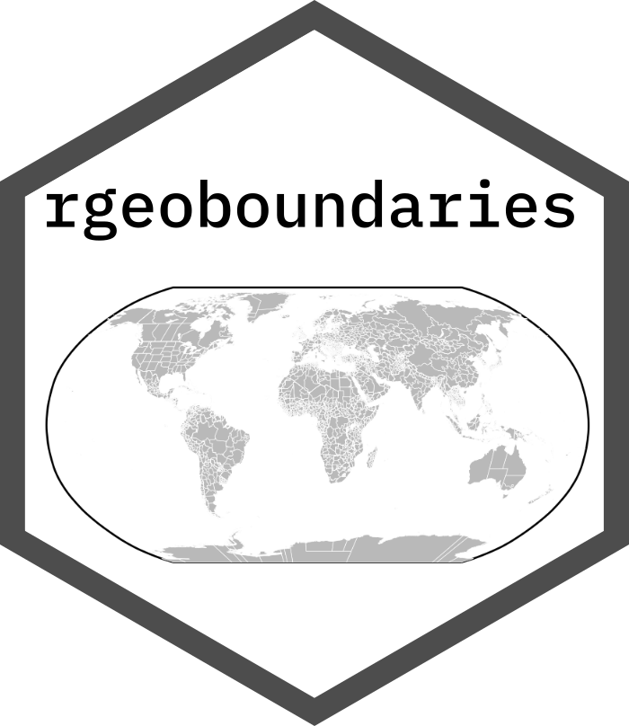
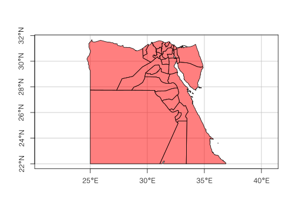

<!-- README.md is generated from README.Rmd. Please edit that file -->

# rgeoboundaries 

<!-- badges: start -->

[](https://gitlab.com/dickoa/rgeoboundaries/pipelines)
[](https://ci.appveyor.com/project/dickoa/rgeoboundaries)
[](https://codecov.io/gl/dickoa/rgeoboundaries)
[](https://cran.r-project.org/package=rgeoboundaries)
[](https://opensource.org/licenses/MIT)

`rgeoboundaries` is an R client for the [geoBoundaries
API](https://www.geoboundaries.org/), providing country political
administrative boundaries.

<!-- badges: end -->

## Installation

You can install the development version of rgeoboundaries using the
`remotes` package:

``` r
# install.packages("remotes")
remotes::install_gitlab("dickoa/rgeoboundaries")
```

## Access administrative boundaries using rgeoboundaries

This is a basic example which shows you how get Mali and Senegal
boundaries and plot it

``` r
library(rgeoboundaries)
library(sf)
mli_sen <- gb_adm0(c("mali", "senegal"), type = "sscgs")
plot(st_geometry(mli_sen))
```


We can also get the first administrative division of all countries in
the World.

``` r
egy <- gb_adm1("egypt")
plot(st_geometry(egy),
     col = rgb(red = 1, green = 0, blue = 0, alpha = 0.5),
     axes = TRUE, graticule = TRUE)
```



``` r
knitr::kable(gb_metadata(c("mali", "senegal"), "adm1"))
```

| boundaryID            | boundaryISO | boundaryYear | boundaryType | boundarySource.1                                                                                         | boundarySource.2                                                                                                       | boundaryLicense                                            | licenseDetail                                 | licenseSource                                                                                                           | boundarySourceURL                                                                                                       | boundaryUpdate | downloadURL                                                                                        | gjDownloadURL                                                                                      | imagePreview                                                                                          |
| :-------------------- | :---------- | :----------- | :----------- | :------------------------------------------------------------------------------------------------------- | :--------------------------------------------------------------------------------------------------------------------- | :--------------------------------------------------------- | :-------------------------------------------- | :---------------------------------------------------------------------------------------------------------------------- | :---------------------------------------------------------------------------------------------------------------------- | :------------- | :------------------------------------------------------------------------------------------------- | :------------------------------------------------------------------------------------------------- | :---------------------------------------------------------------------------------------------------- |
| MLI-ADM1-3\_0\_0-G348 | MLI         | 2015.0       | ADM1         | DNCT - Direction Nationale des Colelctivités Territorielles, DNP - Direction Nationale de la Population | United Nations Office for the Coordination of Humanitarian Affairs, Mali                                               | Creative Commons Attribution 4.0 International (CC BY 4.0) | Noted in metadata tab                         | <https://data.humdata.org/dataset/mali-admin-boundaries-level-1-2-and-3-including-2017-population-desagregated-by-sexe> | <https://data.humdata.org/dataset/mali-admin-boundaries-level-1-2-and-3-including-2017-population-desagregated-by-sexe> | 2020-05-25     | <https://geoboundaries.org/data/geoBoundaries-3_0_0/MLI/ADM1/geoBoundaries-3_0_0-MLI-ADM1-all.zip> | <https://geoboundaries.org/data/geoBoundaries-3_0_0/MLI/ADM1/geoBoundaries-3_0_0-MLI-ADM1.geojson> | <https://geoboundaries.org/data/geoBoundaries-3_0_0/MLI/ADM1/geoBoundariesPreview-3_0_0-MLI-ADM1.png> |
| SEN-ADM1-3\_0\_0-G486 | SEN         | 2017.0       | ADM1         | Government of Senegal                                                                                    | United Nations Office for the Coordination of Humanitarian Affairs Regional Office for West and Central Africa (ROWCA) | Other - Humanitarian                                       | Humanitarian use only - Noted in metadata tab | <https://data.humdata.org/dataset/senegal-administrative-boundaries>                                                    | <https://data.humdata.org/dataset/senegal-administrative-boundaries>                                                    | 2020-05-25     | <https://geoboundaries.org/data/geoBoundaries-3_0_0/SEN/ADM1/geoBoundaries-3_0_0-SEN-ADM1-all.zip> | <https://geoboundaries.org/data/geoBoundaries-3_0_0/SEN/ADM1/geoBoundaries-3_0_0-SEN-ADM1.geojson> | <https://geoboundaries.org/data/geoBoundaries-3_0_0/SEN/ADM1/geoBoundariesPreview-3_0_0-SEN-ADM1.png> |

## How to to cite

If you are using this package in your analysis, please cite the original
`geoBoundaries` work:

> Runfola, D., Seitz, L., Hobbs, L., Panginaban, J., Oberman, R. et
> al. geoBoundaries Global Administrative Database.
> <http://www.geoboundaries.org>.
